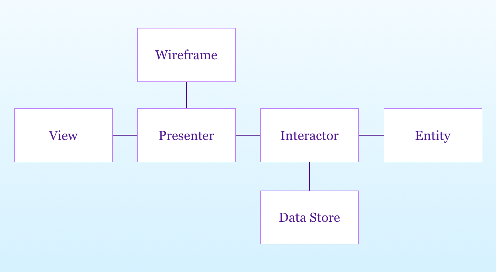

# VIPER Sample

## VIPER Component
- View
	- Class with code to display app interface to user and get response
- Interactor
	- Responsible for the business logic of the app (mainly responsible for API calls)
	- It is responsible for calling data, but it does not have to be implemented on its own.
	- In general, it's up to the Interactor to start working with the network, but it doesn't handle the networking code directly.
- Presenter
	- CORE
	- View gets your response and acts accordingly, communicating with all other components.
	- It is up to the Presenter to take the data returned by the Interactor and format it for present.
- Entity
	- The model class used by the interactor and the related Manager are never sent to the Presenter.
- Router (WireFrame)
	- Switch Screens, hear what screens are displayed and run from the presenter.
	- I own a UIWindow, UINavigationController, UIViewController, etc.
	- It is responsible for writing the view / view controller and installing it in the window.
- DataStore
	- Responsible for providing entities to the Interactor.
	- Manage the persistence of an entity.
	- DataManager is to facilitate the interaction between the datastore and the interactor
		- Helps the interactor focus more on the business logic.

## Protocol description of the VIPER implementation
- ViewProtocol: Reflect changes in the UI to the View through the Presenter
- PresenterProtocol: Handles the response obtained through the view (or Binding rx)
- InteractorInputProtocol: implements presenter passing business logic
- InteractorOutputProtocol: consists of passing changed results back to the Presenter through the Interactor
- RouterProtocol: Creates a view and implements a transition to another view

## StoryBoard
- It is difficult to achieve all the goals of VIPER while taking all the features that storyboard provides.
	- To compromise: not using segue
	- The use of segues makes it very difficult to keep the separation between the screen and the UI and Application Logig intact.

## Modules
- A module can usually be described as a function.
- The separation between modules should be clear.
- Definition of two protocols for the module
	- Module interface defines what the module can do
	- Delegate explaining what the module did
- Modules can include entities, interactors, and general application logic layers that can be used across multiple screens.
- The advantage is that it is easy to scale to multiple form factors. (mac, iPad, iPhone, etc.)

## Test
- Interactor includes pure logic independent of any UI for easy testing.
- Presenter contains logic to prepare data for display and is independent of UIKit.
- The preferred way is to start with Interactor.
	- Everything in the UI exists to meet the needs of use cases.
	- Use TDD to test Interacter's API make better understand the relationship between the UI and use cases.
- If you develop an Interactor first and then a Presenter, you will first be able to implement a series of tests around those layers and lay the groundwork.
	- You can iterate quickly in these classes because you don't need to interact with the UI for the test.
	- After that, if you develop the view, it means you start with working and tested logic and the Present layer.
